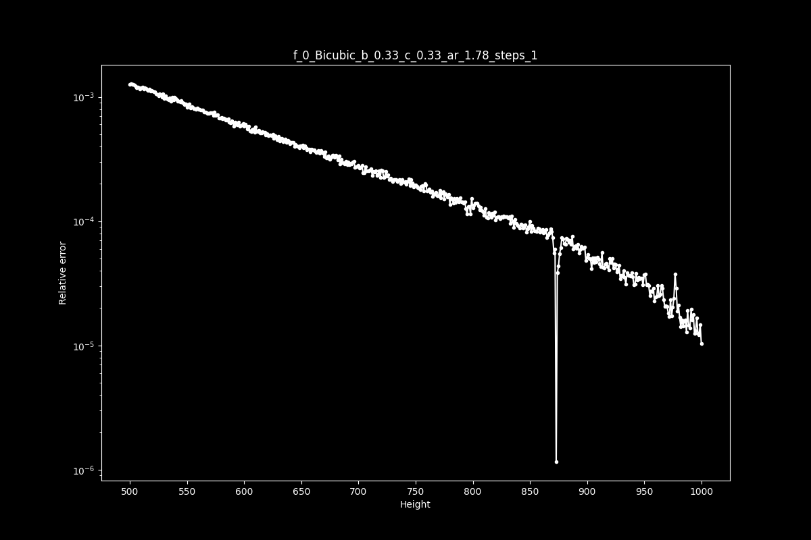

# Getnative
Find the native resolution(s) of upscaled material (mostly anime)

# Usage
Start by executing:

    $ getnative [--args] inputFile
    
If `getnative` could not be found, try executing this:

    # Linux
    $ python -m getnative [--args] inputFile
    
    # Windows
    $ py -3 -m getnative [--args] inputFile

***or***  

Start by executing:

    $ python -m getnative [--args] inputFile

That's it.

# Requirements

To run this script you will need:

* Python 3.6
* [matplotlib](http://matplotlib.org/users/installing.html)
* [Vapoursynth](http://www.vapoursynth.com) R45+
* [descale](https://github.com/Irrational-Encoding-Wizardry/vapoursynth-descale)
* [ffms2](https://github.com/FFMS/ffms2) **or** [lsmash](https://github.com/VFR-maniac/L-SMASH-Works) **or** [imwri](https://forum.doom9.org/showthread.php?t=170981)  
 \*imwri: ImageMagick7 is required for macOS and Linux 

#### Installation
Install it via:

    $ pip install getnative

**or**

* Download all files from github  
* Install all dependencies through `pip install -r requirements.txt`  

#### Recommended Windows Installation

Install these programs from their websites:

* [Vapoursynth](http://www.vapoursynth.com) (includes imwri)

Once Vapoursynth is installed:

    vsrepo.py install descale
    vsrepo.py install ffms2
    vsrepo.py install lsmas

Install getnative (and Python dependencies):

    pip install getnative

# Example Output
Input Command:

    $ getnative -k bicubic -b 0.33 -c 0.33 -dir "../../Downloads" "../../Downloads/unknown.png"

Terminal Output:
```
Using imwri as source filter

500/500

Output Path: /Users/infi/Downloads/results

Bicubic b 0.33 c 0.33 AR: 1.78 Steps: 1
Native resolution(s) (best guess): 873p

done in 13.56s
```

Output Graph:



Output TXT (summary):
```
 868		 | 0.0000863251		 | 0.93
 869		 | 0.0000828592		 | 1.04
 870		 | 0.0000734709		 | 1.13
 871		 | 0.0000555885		 | 1.32
 872		 | 0.0000596791		 | 0.93
 873		 | 0.0000011579		 | 51.54
 874		 | 0.0000385670		 | 0.03
 875		 | 0.0000433674		 | 0.89
 876		 | 0.0000548476		 | 0.79
 877		 | 0.0000614557		 | 0.89
 878		 | 0.0000740702		 | 0.83
```

# Args

| Property | Description | Default value | Type |
| -------- | ----------- | ------------------ | ---- |
| frame | Specify a frame for the analysis. | num_frames//3 | Int |
| kernel | Resize kernel to be used | bicubic | String |
| bicubic-b | B parameter of bicubic resize | 1/3 | Float |
| bicubic-c | C parameter of bicubic resize | 1/3 | Float |
| lanczos-taps | Taps parameter of lanczos resize | 3 | Int |
| aspect-ratio | Force aspect ratio. Only useful for anamorphic input| w/h | Float |
| min-height | Minimum height to consider | 500 | Int |
| max-height | Maximum height to consider | 1000 | Int |
| is-image | Force image input | False | Action |
| generate-images | Save detail mask as png | False | Action |
| plot-scaling | Scaling of the y axis. Can be "linear" or "log" | log | String |
| plot-format | Format of the output image. Specify multiple formats separated by commas. Can be svg, png, tif(f), and more | svg | String |
| show-plot-gui | Show an interactive plot gui window. | False | Action |
| no-save | Do not save files to disk. | False | Action |
| stepping | This changes the way getnative will handle resolutions. Example steps=3 [500p, 503p, 506p ...] | 1 | Int |
| output-dir | Sets the path of the output dir where you want all results to be saved. (/results will always be added as last folder) | (CWD)/results | String |

# CLI Args

| Property | Description | Default value | Type |
| -------- | ----------- | ------------------ | ---- |
| help | Automatically render the usage information when running `-h` or `--help` | False | Action |
|  | Absolute or relative path to the input file | Required | String |
| mode | Choose a predefined mode \["bilinear", "bicubic", "bl-bc", "all"\] | None | String |
| use | Use specified source filter (e.g. "lsmas.LWLibavSource") | None | String |

# Warning
This script's success rate is far from perfect.
If possible, do multiple tests on different frames from the same source.
Bright scenes generally yield the most accurate results.
Graphs tend to have multiple notches, so the script's assumed resolution may be incorrect.
Also, due to the current implementation of the autoguess, it is not possible for the script 
to automatically recognize 1080p productions.
Use your eyes or anibin if necessary.
  
# Thanks  
BluBb_mADe, kageru, FichteFoll, stux!, LittlePox

# Help?

Join https://discord.gg/UERrfucRFD (Ask in #encode-autism for help)
